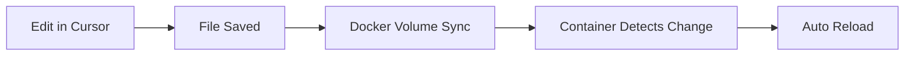

# Docker Development Workflow

## Overview

This project uses **Docker for everything** - all services, testing, and runtime environments run in containers. You write code in Cursor IDE with live file watching, and Docker handles the execution.

**Development Model:**
- ✅ **Code in Cursor IDE** - Edit files locally with full IDE features
- ✅ **Run in Docker** - All execution happens in containers
- ✅ **Live Reload** - Code changes automatically reflected in containers
- ❌ **No local Python/Node** - Not needed (Docker handles it)

---

## ⚠️ Important: Working Directory

**All docker commands must be run from the `docker/` folder!**

The `docker-compose.yml` file is located in `docker/`, so you must:

```bash
cd docker                    # Navigate to docker folder
docker compose up -d         # Now commands work
```

**Why?** Docker Compose looks for `docker-compose.yml` in the current directory.

---

## Quick Start

### 1. Start All Services

```bash
# Navigate to docker folder first!
cd docker

# Start everything (API, Worker, Database, Redis, MinIO)
docker compose up -d

# View logs
docker compose logs -f api
docker compose logs -f worker
```

### 2. Run Commands in Docker

```bash
# Make sure you're in the docker folder!
cd docker

# Run any Python command
docker compose exec api python script.py

# Run database migrations
docker compose exec api alembic upgrade head

# Run tests
docker compose exec api pytest

# Get a shell inside the container
docker compose exec api bash
```

### 3. Stop Services

```bash
# Stop all services
docker compose down

# Stop and remove volumes (clean slate)
docker compose down -v
```

---

## Development Workflow

### Daily Workflow

```bash
# 1. Navigate to docker folder
cd docker

# 2. Start services in the morning
docker compose up -d

# 3. Code in Cursor IDE (from project root or anywhere)
# - Edit files locally (e.g., backend/app/api/routes/pages.py)
# - Changes automatically sync to containers
# - API auto-reloads on file changes

# 4. Run tests as you code (from docker folder)
cd docker  # If not already there
docker compose exec api pytest tests/

# 5. Check logs if needed
docker compose logs -f api

# 6. Stop services at end of day
docker compose down
```

### Making Code Changes



**Example:**
1. Edit `backend/app/api/routes/pages.py` in Cursor
2. Save file (Ctrl+S / Cmd+S)
3. Docker volume syncs file to container
4. Uvicorn detects change and reloads
5. New code is live immediately

---

## Running Tests

### Unit Tests

```bash
# Run all tests
docker compose exec api pytest

# Run specific test file
docker compose exec api pytest tests/test_ocr_service.py

# Run with coverage
docker compose exec api pytest --cov=app tests/

# Run with verbose output
docker compose exec api pytest -v
```

### Integration Tests

```bash
# Run integration tests (requires database)
docker compose exec api pytest tests/integration/

# Run specific integration test
docker compose exec api pytest tests/integration/test_document_upload.py
```

### Verification Script

```bash
# Run Phase 1B verification
docker compose exec api python test_ocr_verification.py

# Run with database access (works inside Docker)
docker compose exec api python -m pytest tests/
```

---

## Database Operations

### Migrations

```bash
# Check current migration
docker compose exec api alembic current

# Create new migration
docker compose exec api alembic revision --autogenerate -m "description"

# Apply migrations
docker compose exec api alembic upgrade head

# Rollback one migration
docker compose exec api alembic downgrade -1
```

### Database Access

```bash
# Connect to PostgreSQL
docker compose exec db psql -U forgex -d forgex

# Run SQL query
docker compose exec db psql -U forgex -d forgex -c "SELECT * FROM projects;"

# Dump database
docker compose exec db pg_dump -U forgex forgex > backup.sql
```

---

## Debugging

### View Logs

```bash
# All services
docker compose logs -f

# Specific service
docker compose logs -f api
docker compose logs -f worker
docker compose logs -f db

# Last 100 lines
docker compose logs --tail=100 api
```

### Interactive Shell

```bash
# Python shell in API container
docker compose exec api python

# Bash shell in API container
docker compose exec api bash

# Inside container, you can:
cd /app
ls -la
python -m app.main
```

### Debug API

```bash
# Get shell in API container
docker compose exec api bash

# Run API with debug logging
uvicorn app.main:app --reload --log-level debug

# Or use Python debugger
python -m pdb -m uvicorn app.main:app
```

---

## Installing New Packages

### Backend (Python)

```bash
# 1. Add package to requirements.txt
echo "new-package==1.0.0" >> backend/requirements.txt

# 2. Rebuild API container
docker compose build api

# 3. Restart API
docker compose up -d api

# Or install without rebuild (temporary)
docker compose exec api pip install new-package
```

### Frontend (Node)

```bash
# 1. Add package to package.json
cd frontend
npm install new-package

# 2. Rebuild frontend container
docker compose build frontend

# 3. Restart frontend
docker compose up -d frontend
```

---

## Common Tasks

### Reset Everything

```bash
# Stop and remove all containers, volumes, networks
docker compose down -v

# Rebuild from scratch
docker compose build --no-cache

# Start fresh
docker compose up -d
```

### Check Service Health

```bash
# Check all services
docker compose ps

# Check API health
curl http://localhost:8000/api/v1/health

# Check if containers are running
docker compose ps api worker db redis minio
```

### View Container Resources

```bash
# Resource usage
docker stats

# Disk usage
docker system df

# Clean up unused resources
docker system prune -a
```

---

## File Structure

### Volume Mounts

```yaml
# docker-compose.yml
services:
  api:
    volumes:
      - ./backend:/app  # Local code → Container
```

**What this means:**
- Your local `backend/` folder is mounted into the container at `/app`
- Changes you make locally appear instantly in the container
- No need to rebuild for code changes

### Important Paths

| Local Path | Container Path | Purpose |
|------------|---------------|---------|
| `./backend` | `/app` | Backend code |
| `./frontend` | `/app` | Frontend code |
| `./backend/alembic` | `/app/alembic` | Database migrations |
| `./backend/tests` | `/app/tests` | Test files |

---

## Environment Variables

### Development (.env)

**IMPORTANT:** The `.env` file must be in the `docker/` folder!

```bash
# Copy example to docker folder
cp docker-env.example docker/.env

# Edit as needed
nano docker/.env

# Or use your preferred editor
code docker/.env
```

### Required Variables

```bash
# Database
DATABASE_URL=postgresql+asyncpg://forgex:forgex@db:5432/forgex

# Redis
REDIS_URL=redis://redis:6379/0
CELERY_BROKER_URL=redis://redis:6379/1

# Storage
STORAGE_ENDPOINT=minio:9000
STORAGE_ACCESS_KEY=minioadmin
STORAGE_SECRET_KEY=minioadmin

# Google Cloud Vision (Phase 1B)
GOOGLE_APPLICATION_CREDENTIALS=/app/credentials/google-cloud-key.json
```

### Mounting Credentials

```yaml
# docker-compose.yml
services:
  api:
    volumes:
      - ./credentials:/app/credentials  # Mount credentials folder
```

---

## Troubleshooting

### Container Won't Start

```bash
# Check logs
docker compose logs api

# Check if port is in use
netstat -an | grep 8000

# Remove and recreate
docker compose down
docker compose up -d
```

### Code Changes Not Reflected

```bash
# 1. Check volume mount
docker compose exec api ls -la /app

# 2. Restart service
docker compose restart api

# 3. Check if auto-reload is enabled
docker compose logs api | grep "Uvicorn running"
```

### Database Connection Issues

```bash
# Check database is running
docker compose ps db

# Check connection
docker compose exec api python -c "from app.database import engine; print(engine)"

# Reset database
docker compose down -v
docker compose up -d db
docker compose exec api alembic upgrade head
```

### Permission Issues (Windows)

```bash
# If you see permission errors, ensure Docker has access to your drive
# Docker Desktop → Settings → Resources → File Sharing
# Add your project directory
```

---

## Best Practices

### ✅ DO

- **Edit code in Cursor IDE** - Full IDE features, syntax highlighting
- **Run commands via `docker compose exec`** - Consistent environment
- **Use volume mounts** - Instant code sync
- **Check logs regularly** - `docker compose logs -f`
- **Commit `.env.example`** - Never commit `.env`

### ❌ DON'T

- **Install packages locally** - Use Docker containers
- **Run Python/Node locally** - Everything in Docker
- **Modify files inside containers** - Edit locally instead
- **Use `docker exec` directly** - Use `docker compose exec`
- **Commit credentials** - Use `.env` (gitignored)

---

## IDE Integration

### Cursor IDE Setup

1. **Open Project:**
   ```bash
   cursor .
   ```

2. **Python Extension:**
   - Cursor will detect Python files
   - Syntax highlighting works automatically
   - No local Python interpreter needed

3. **Terminal:**
   - Use Cursor's integrated terminal
   - Run `docker compose` commands directly

### VS Code (Alternative)

If using VS Code, install:
- Docker extension
- Python extension (for syntax only)
- Remote - Containers extension (optional)

---

## Performance Tips

### Speed Up Builds

```bash
# Use BuildKit
export DOCKER_BUILDKIT=1

# Build with cache
docker compose build

# Parallel builds
docker compose build --parallel
```

### Reduce Container Size

```dockerfile
# Use slim images
FROM python:3.11-slim

# Multi-stage builds
FROM node:18 AS builder
# ... build steps
FROM node:18-slim
COPY --from=builder /app/dist /app/dist
```

### Optimize Volume Mounts

```yaml
# Exclude node_modules from sync (faster)
volumes:
  - ./frontend:/app
  - /app/node_modules  # Use container's node_modules
```

---

## CI/CD Integration

### GitHub Actions

```yaml
# .github/workflows/test.yml
name: Test
on: [push, pull_request]
jobs:
  test:
    runs-on: ubuntu-latest
    steps:
      - uses: actions/checkout@v2
      - name: Run tests
        run: |
          docker compose up -d
          docker compose exec -T api pytest
```

### Pre-commit Hooks

```bash
# Install pre-commit
pip install pre-commit

# Setup hooks
pre-commit install

# Hooks run in Docker
# .pre-commit-config.yaml
repos:
  - repo: local
    hooks:
      - id: pytest
        name: pytest
        entry: docker compose exec -T api pytest
```

---

## Quick Reference

### Essential Commands

```bash
# Start
docker compose up -d

# Stop
docker compose down

# Logs
docker compose logs -f api

# Shell
docker compose exec api bash

# Tests
docker compose exec api pytest

# Migrations
docker compose exec api alembic upgrade head

# Rebuild
docker compose build api && docker compose up -d api
```

### Service URLs

| Service | URL | Purpose |
|---------|-----|---------|
| API | http://localhost:8000 | Backend API |
| API Docs | http://localhost:8000/api/docs | Swagger UI |
| Frontend | http://localhost:5173 | React app |
| MinIO Console | http://localhost:9001 | Storage UI |
| PostgreSQL | localhost:5432 | Database |
| Redis | localhost:6379 | Cache/Queue |

---

## Summary

**Your Workflow:**
1. ✅ Code in Cursor IDE (local files)
2. ✅ Run in Docker (containers)
3. ✅ Test in Docker (`docker compose exec api pytest`)
4. ✅ Debug with Docker logs (`docker compose logs -f`)
5. ✅ Deploy with Docker (same containers)

**Benefits:**
- Consistent environment (dev = prod)
- No local dependencies needed
- Easy onboarding (just `docker compose up`)
- Isolated services
- Easy cleanup

---

**Last Updated:** January 19, 2026  
**Docker Compose Version:** 2.x+  
**Docker Version:** 20.10+
