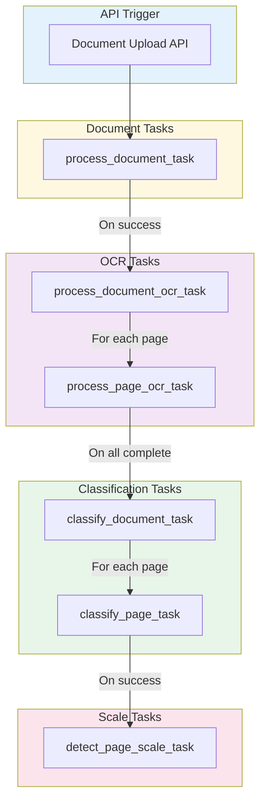
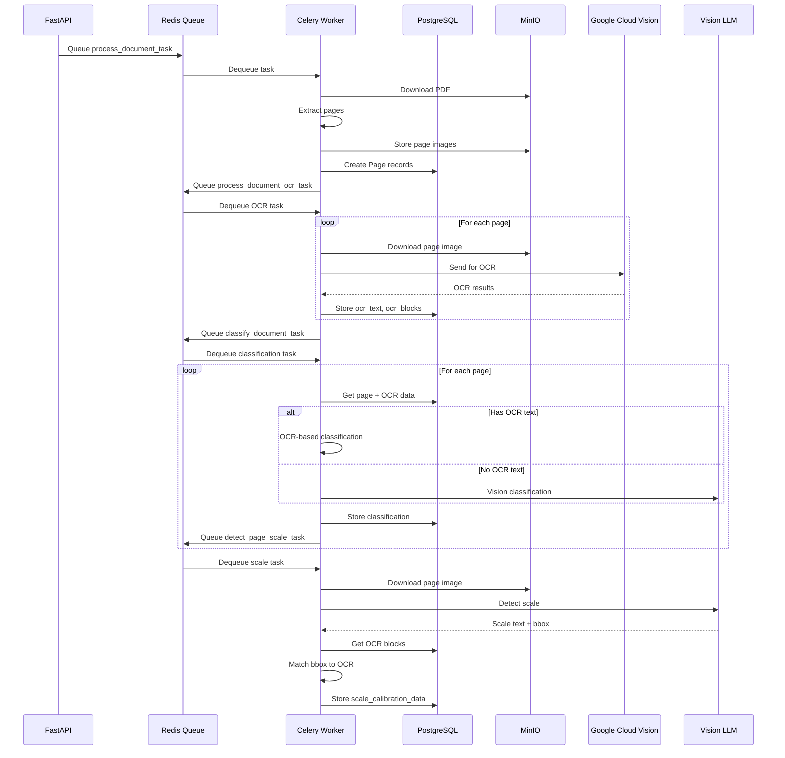
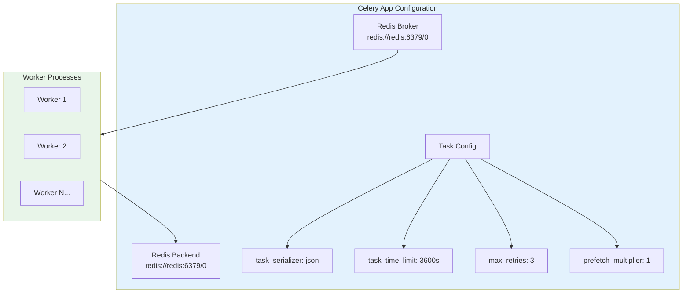
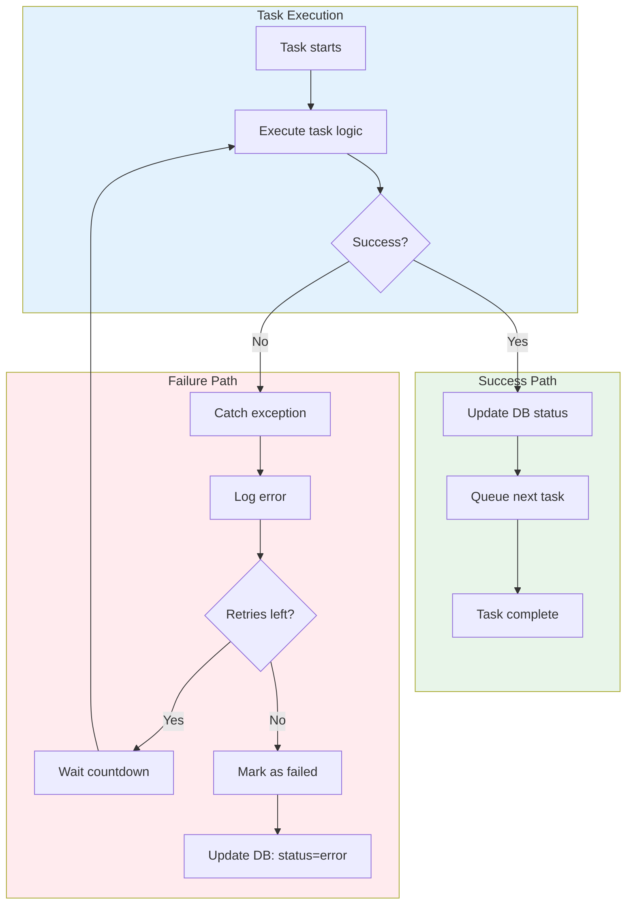
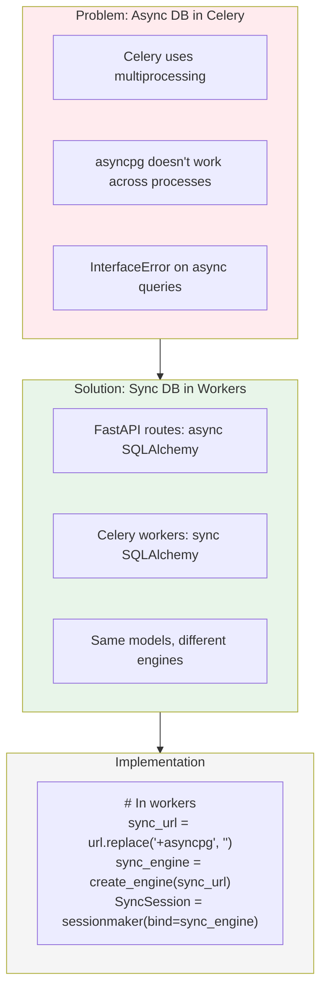
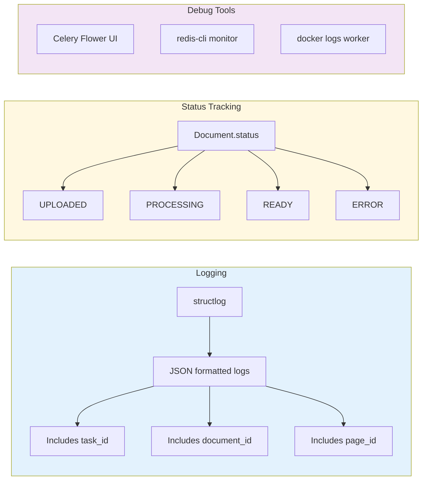

# Celery Task Chain

How background tasks are orchestrated and chained together.

## Task Dependency Graph



## Task Execution Sequence



## Task Configuration



## Error Handling & Retries



## Task Definitions

| Task | File | Triggers | Queues Next |
|------|------|----------|-------------|
| `process_document_task` | `document_tasks.py` | Document upload API | `process_document_ocr_task` |
| `process_document_ocr_task` | `ocr_tasks.py` | Document processing complete | `classify_document_task` |
| `process_page_ocr_task` | `ocr_tasks.py` | Called by document OCR | - |
| `classify_document_task` | `classification_tasks.py` | OCR complete | `detect_page_scale_task` |
| `classify_page_task` | `classification_tasks.py` | Called by document classify | - |
| `detect_page_scale_task` | `scale_tasks.py` | Classification complete | - |

## Database Synchronization Pattern



## Monitoring & Debugging



## Docker Compose Services

```yaml
# Relevant services for task processing
services:
  api:
    # FastAPI - queues tasks
    
  worker:
    # Celery worker - processes tasks
    command: celery -A app.workers.celery_app worker
    
  redis:
    # Message broker & result backend
    
  db:
    # PostgreSQL - shared by API and workers
```
