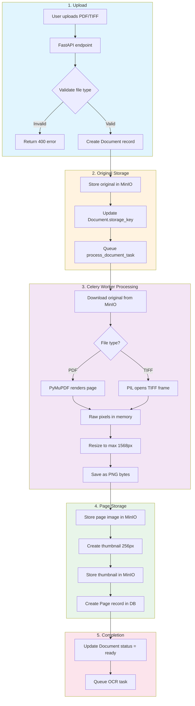
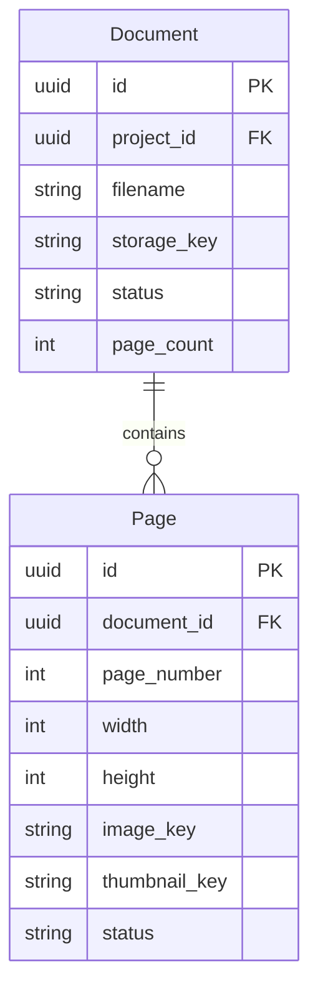
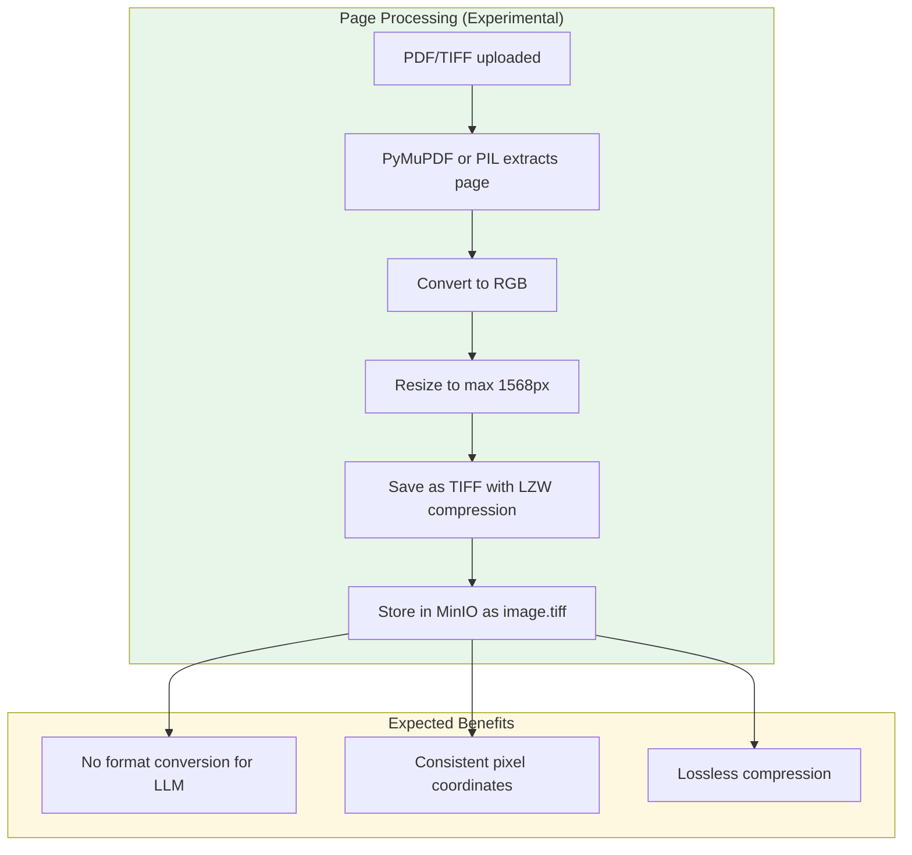

# Document Processing Pipeline

How uploaded documents (PDF/TIFF) are processed into page images.

## Flow Diagram



## Key Components

| Component | File | Purpose |
|-----------|------|---------|
| Upload endpoint | `backend/app/api/routes/documents.py` | Receives file, validates, creates record |
| Document processor | `backend/app/services/document_processor.py` | Orchestrates extraction and storage |
| PDF utilities | `backend/app/utils/pdf_utils.py` | PDF/TIFF rendering and resizing |
| Celery task | `backend/app/workers/document_tasks.py` | Async processing worker |
| Storage service | `backend/app/utils/storage.py` | MinIO S3-compatible storage |

## Storage Structure

```
MinIO Bucket
└── projects/{project_id}/
    └── documents/{document_id}/
        ├── original/
        │   └── {filename}.pdf          # Original uploaded file
        └── pages/{page_id}/
            ├── image.png               # Full resolution (max 1568px)
            └── thumbnail.png           # 256px thumbnail
```

## Database Records



---

## Experimental: TIFF Storage Format (January 2026)

> **Status**: Testing in progress. This section documents an experimental change to evaluate coordinate accuracy improvements.

### Rationale

PDFs can contain embedded fonts, layers, transparency, and other elements that may render inconsistently across different tools. By converting all pages to TIFF format at a fixed resolution, we ensure:

1. **Flattened raster output** - What you see is what OCR and LLM see
2. **Consistent format** - No format conversion needed between storage and analysis
3. **Eliminated compression artifacts** - LZW is lossless, unlike JPEG
4. **Single coordinate system** - Fixed 1568px max dimension means no scale factor tracking

### Changes from PNG Storage

| Aspect | Previous (PNG) | Experimental (TIFF) |
|--------|----------------|---------------------|
| Storage format | `image.png` | `image.tiff` |
| Content type | `image/png` | `image/tiff` |
| Compression | PNG (lossless) | TIFF LZW (lossless) |
| Thumbnail | PNG (unchanged) | PNG (unchanged) |

### Updated Storage Structure

```
MinIO Bucket
└── projects/{project_id}/
    └── documents/{document_id}/
        ├── original/
        │   └── {filename}.pdf          # Original uploaded file
        └── pages/{page_id}/
            ├── image.tiff              # Full resolution (max 1568px) - TIFF with LZW
            └── thumbnail.png           # 256px thumbnail (still PNG for web)
```

### Processing Flow Change



### Files Modified

| File | Change |
|------|--------|
| `backend/app/utils/pdf_utils.py` | Default format changed to TIFF, added LZW compression |
| `backend/app/services/document_processor.py` | Storage key `.png` → `.tiff`, content type updated |

### Testing Checklist

- [ ] Upload PDF → Verify `.tiff` storage
- [ ] Upload multi-page TIFF → Verify re-normalized as `.tiff`
- [ ] OCR works on TIFF images
- [ ] Scale detection returns accurate coordinates
- [ ] LLM vision analysis works with TIFF
- [ ] Thumbnails remain PNG for web display
- [ ] Frontend viewer renders TIFF images correctly
