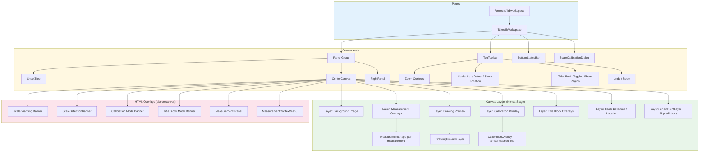
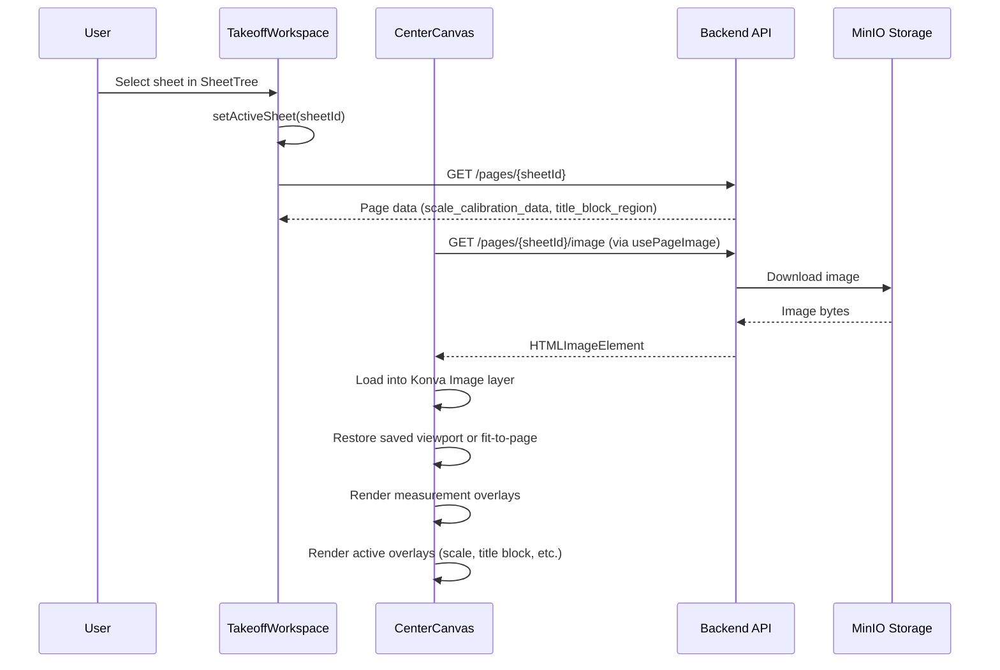
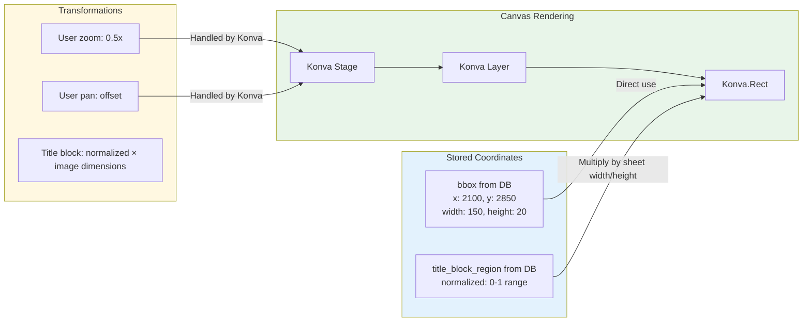
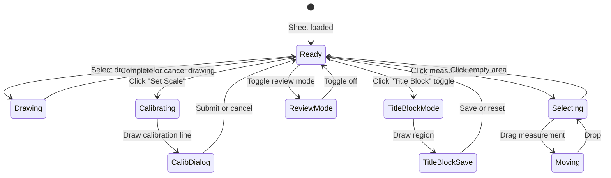

# Frontend Canvas Rendering

How the TakeoffWorkspace canvas displays page images, measurement overlays, and scale/calibration layers.

> **Note:** The legacy `TakeoffViewer` at `/documents/:id/pages/:id` is deprecated and shows a deprecation banner. All new development targets `TakeoffWorkspace`.

## Component Architecture



## Image Loading Flow



## Scale Calibration Rendering

```mermaid
flowchart TD
    subgraph Trigger["User Action"]
        BTN[TopToolbar: Set Scale] --> START[startCalibration]
    end

    subgraph Drawing["Calibration Drawing"]
        START --> MODE[isCalibrating = true]
        MODE --> CLICK1[Click: startDrawing point]
        CLICK1 --> MOVE[Mouse move: updateDrawing]
        MOVE --> CLICK2[Click: finishDrawing]
    end

    subgraph Overlay["CalibrationOverlay (Konva Layer)"]
        MOVE --> LINE[Dashed amber line: start → current]
        CLICK2 --> FINAL_LINE[Solid amber line: start → end]
    end

    subgraph Dialog["ScaleCalibrationDialog"]
        CLICK2 --> DIALOG[Opens dialog with pixel distance]
        DIALOG --> INPUT[User enters real distance + unit]
        INPUT --> SUBMIT[POST /pages/{id}/calibrate]
        SUBMIT --> DONE[Calibration saved, dialog closes]
    end

    style Trigger fill:#e3f2fd
    style Drawing fill:#fff8e1
    style Overlay fill:#e8f5e9
    style Dialog fill:#fce4ec
```

## Scale Detection Overlay

```mermaid
flowchart TD
    subgraph Data["Data Source"]
        PAGE[Page Object] --> SCD[scale_calibration_data]
        SCD --> BEST[best_scale]
        BEST --> BBOX[bbox: x, y, width, height]
        BEST --> TEXT[text: "1/4 inch = 1 foot"]
    end

    subgraph State["React State"]
        SHOW[showScaleLocation: boolean]
        DET[detectionResult: ScaleDetectionResult]
        HIGH[scaleHighlightBox: bbox]
    end

    subgraph Render["Konva Rendering"]
        BBOX --> RECT_LOC[Scale Location Rect — green, 15% opacity]
        SHOW --> COND1{Show location?}
        COND1 -->|Yes| RECT_LOC
        COND1 -->|No| HIDDEN1[Not rendered]

        HIGH --> RECT_DET[Detection Highlight Rect — amber, animated]
        DET --> BANNER[ScaleDetectionBanner — green bar above canvas]
    end

    style Data fill:#e3f2fd
    style State fill:#fff8e1
    style Render fill:#e8f5e9
```

## Title Block Rendering

```mermaid
flowchart TD
    subgraph Mode["Title Block Mode"]
        TOGGLE[TopToolbar: Title Block toggle] --> ACTIVE[isTitleBlockMode = true]
        ACTIVE --> CLICK[Mouse down: start draft rect]
        CLICK --> DRAG[Mouse move: update draft rect]
        DRAG --> RELEASE[Mouse up: finalize draft rect]
    end

    subgraph Overlays["Canvas Overlays"]
        DRAG --> DRAFT[Blue dashed Rect — draft region]
        RELEASE --> BANNER[Save banner appears: Save / Reset]
        SHOW_REGION[Show Region toggle] --> EXISTING[Green filled Rect — saved region]
    end

    subgraph Save["Save Flow"]
        BANNER --> SAVE[POST /documents/{id}/title-block-region]
        SAVE --> OCR[Backend re-runs OCR with new region]
        OCR --> POLL[pollUntil: wait for OCR completion]
        POLL --> DONE[Page data refreshed]
    end

    style Mode fill:#e3f2fd
    style Overlays fill:#fff8e1
    style Save fill:#e8f5e9
```

## Coordinate Handling



**Key Points:**
- Scale bbox coordinates are in image pixel space — used directly by Konva
- Title block region is stored as normalized (0-1) coordinates and converted to pixel coords by multiplying by sheet dimensions
- Konva handles zoom/pan transformations at the Stage level

## Canvas State Modes



## Key Files

| File | Purpose |
|------|---------|
| `frontend/src/components/workspace/TakeoffWorkspace.tsx` | Layout orchestrator, scale/calibration/title block state management |
| `frontend/src/components/workspace/CenterCanvas.tsx` | Konva Stage with all layers, overlays, and event handling |
| `frontend/src/components/workspace/TopToolbar.tsx` | Toolbar with scale, title block, and drawing controls |
| `frontend/src/components/viewer/CalibrationOverlay.tsx` | Konva Layer: dashed amber calibration line |
| `frontend/src/components/viewer/ScaleDetectionBanner.tsx` | HTML: post-detection result banner |
| `frontend/src/components/viewer/MeasurementsPanel.tsx` | HTML: floating measurement list |
| `frontend/src/components/viewer/MeasurementShape.tsx` | Renders individual measurement geometry on Konva |
| `frontend/src/components/viewer/DrawingPreviewLayer.tsx` | Live drawing preview on Konva |
| `frontend/src/hooks/useScaleCalibration.ts` | Scale calibration line drawing state |
| `frontend/src/hooks/useScaleDetection.ts` | AI scale detection with polling |
| `frontend/src/hooks/usePageImage.ts` | Image loading for canvas display |
