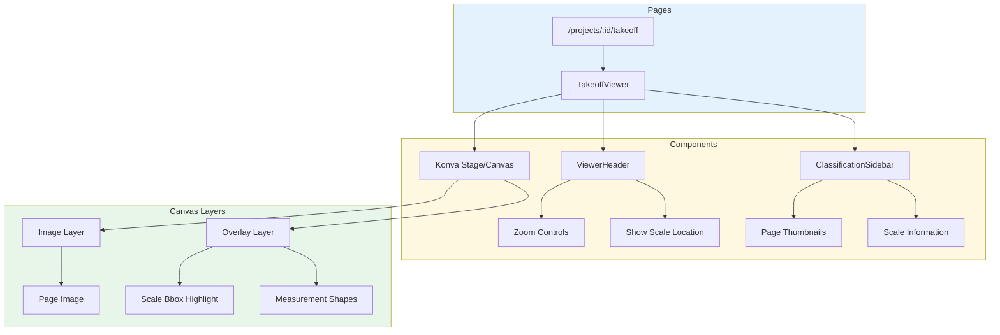
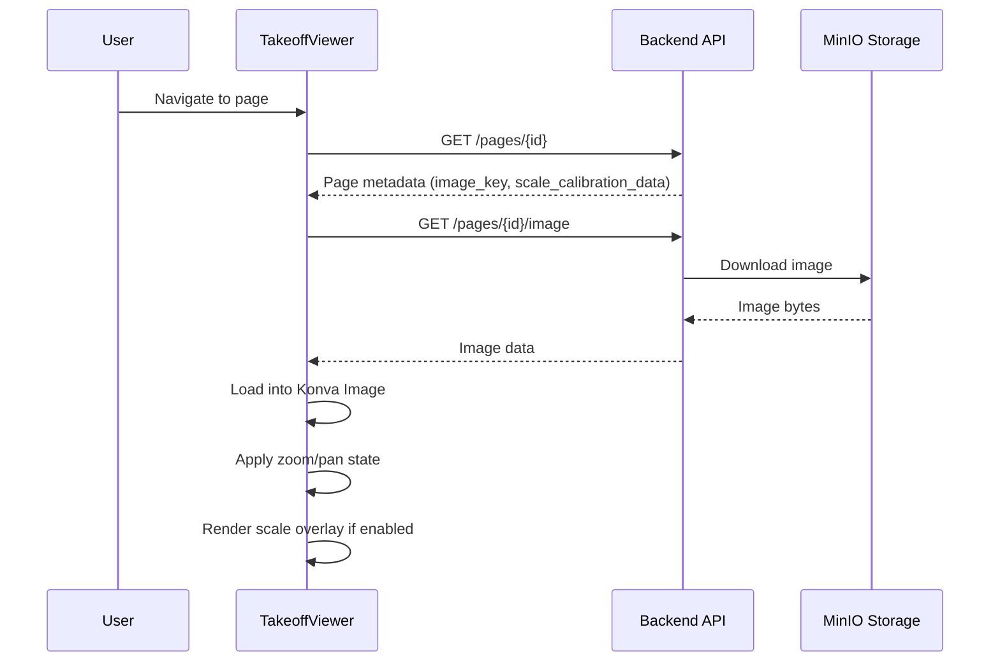
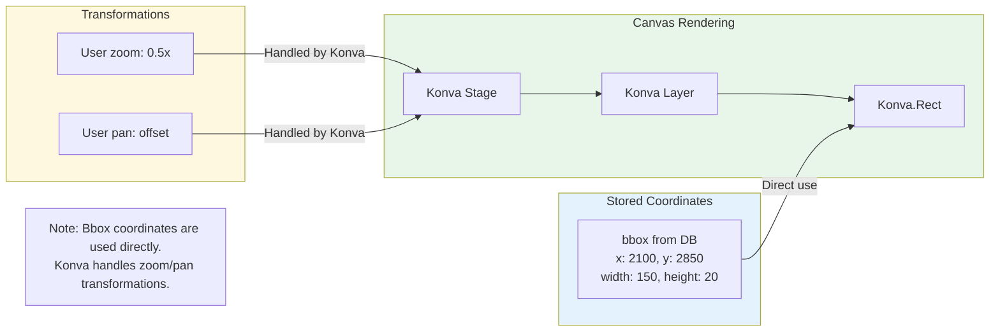
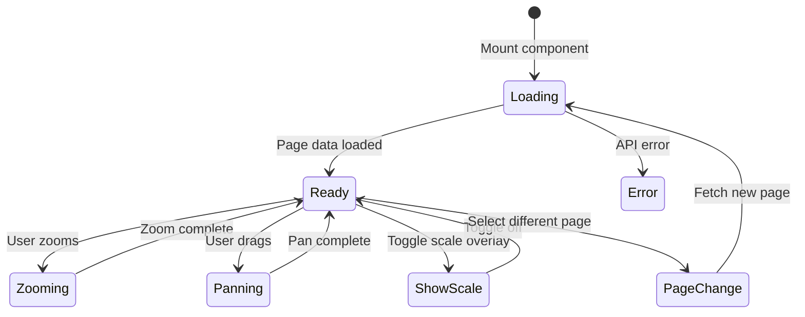
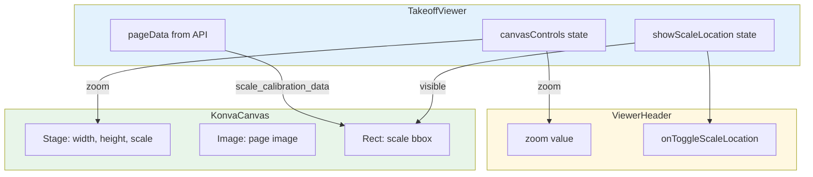

# Frontend Viewer Rendering

How the TakeoffViewer displays page images and scale overlays.

## Component Architecture



## Image Loading Flow



## Scale Overlay Rendering

```mermaid
flowchart TD
    subgraph Data["Data Source"]
        PAGE[Page Object] --> SCD[scale_calibration_data]
        SCD --> BEST[best_scale]
        BEST --> BBOX[bbox: {x, y, width, height}]
    end

    subgraph State["React State"]
        SHOW[showScaleLocation: boolean]
        ZOOM[canvasControls.zoom]
    end

    subgraph Render["Konva Rendering"]
        BBOX --> RECT[Konva.Rect]
        SHOW --> COND{Show overlay?}
        COND -->|Yes| RECT
        COND -->|No| HIDDEN[Not rendered]
        
        RECT --> STYLE[Style:<br/>fill: green 15% opacity<br/>stroke: green<br/>strokeWidth: 3/zoom]
    end

    style Data fill:#e3f2fd
    style State fill:#fff8e1
    style Render fill:#e8f5e9
```

## Coordinate Handling



**Key Point:** The bbox coordinates from `scale_calibration_data` are in the same coordinate space as the stored image. No transformation is needed - Konva handles zoom/pan at the Stage level.

## TakeoffViewer State



## Component Props Flow



## Key Files

| File | Purpose |
|------|---------|
| `frontend/src/pages/TakeoffViewer.tsx` | Main viewer component, canvas setup |
| `frontend/src/components/viewer/ViewerHeader.tsx` | Toolbar with zoom, scale toggle |
| `frontend/src/components/viewer/ClassificationSidebar.tsx` | Page list, scale info display |
| `frontend/src/hooks/useScaleDetection.ts` | Scale detection API calls |
