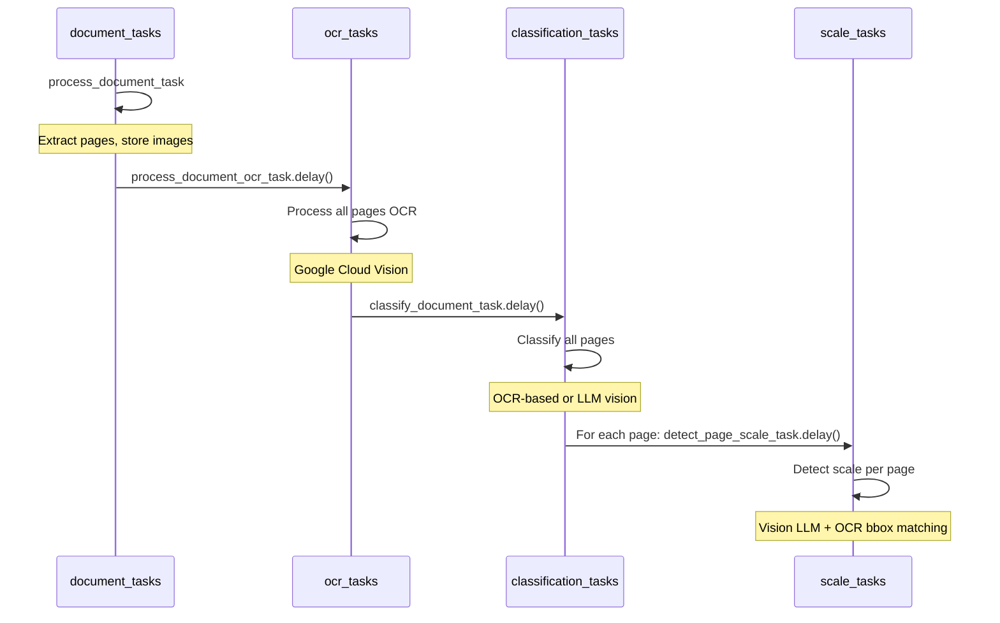
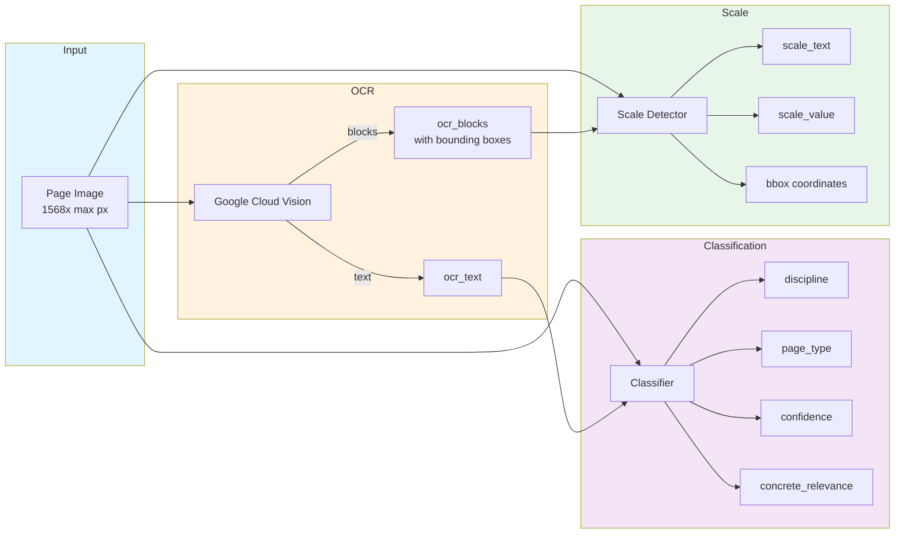

# OCR and Classification Flow

How pages are processed through OCR, classification, and scale detection.

## Task Chain Diagram

```mermaid
flowchart TD
    subgraph Trigger["Trigger"]
        A[Document processing complete] --> B[Queue OCR task]
    end

    subgraph OCR["1. OCR Processing"]
        B --> C[process_document_ocr_task]
        C --> D[For each page in document]
        D --> E[Download page image from MinIO]
        E --> F[Send to Google Cloud Vision]
        F --> G[Receive OCR response]
        G --> H[Extract text blocks with bounding boxes]
        H --> I[Detect patterns: scales, titles, sheet numbers]
        I --> J[Store in Page.ocr_text and Page.ocr_blocks]
    end

    subgraph Classification["2. Classification"]
        J --> K[Queue classification task]
        K --> L[classify_document_task]
        L --> M[For each page]
        M --> N{Has OCR text?}
        N -->|Yes| O[OCR-based classification]
        N -->|No| P[Vision LLM classification]
        O --> Q[Analyze text patterns]
        P --> R[Send image to LLM]
        Q --> S[Determine discipline & page type]
        R --> S
        S --> T[Calculate concrete relevance score]
        T --> U[Store classification in Page record]
    end

    subgraph Scale["3. Scale Detection"]
        U --> V[Queue scale detection task]
        V --> W[detect_page_scale_task]
        W --> X[Download page image]
        X --> Y[Send to Vision LLM]
        Y --> Z[LLM returns scale text + bbox]
        Z --> AA{OCR blocks available?}
        AA -->|Yes| AB[Match scale text to OCR blocks]
        AA -->|No| AC[Use LLM bbox directly]
        AB --> AD[Get pixel-perfect bbox from OCR]
        AC --> AD
        AD --> AE[Store in Page.scale_calibration_data]
    end

    style Trigger fill:#e3f2fd
    style OCR fill:#fff8e1
    style Classification fill:#f3e5f5
    style Scale fill:#e8f5e9
```



## Celery Task Dependencies



## Data Flow



## Page Record After Processing

```json
{
  "id": "uuid",
  "page_number": 1,
  "width": 1568,
  "height": 1045,
  
  "ocr_text": "FOUNDATION PLAN\nSCALE: 1/4\" = 1'-0\"...",
  "ocr_blocks": {
    "blocks": [
      {
        "text": "SCALE: 1/4\" = 1'-0\"",
        "bounding_box": { "x": 2100, "y": 2850, "width": 150, "height": 20 }
      }
    ]
  },
  
  "classification": "foundation_plan",
  "classification_confidence": 0.95,
  "discipline": "structural",
  "page_type": "plan",
  "concrete_relevance": "high",
  
  "scale_text": "1/4\" = 1'-0\"",
  "scale_value": 48.0,
  "scale_calibrated": true,
  "scale_calibration_data": {
    "best_scale": {
      "text": "1/4\" = 1'-0\"",
      "ratio": 48.0,
      "bbox": { "x": 2100, "y": 2850, "width": 150, "height": 20 },
      "confidence": 0.95
    }
  }
}
```

---

## Experimental Note: TIFF Storage (January 2026)

> **Status**: Testing in progress

As of January 2026, page images are experimentally stored as TIFF instead of PNG:

- **Storage key**: `image.tiff` (was `image.png`)
- **Content type**: `image/tiff` (was `image/png`)
- **Compression**: TIFF LZW (lossless)
- **Thumbnails**: Still PNG for web compatibility

This change is being tested to evaluate whether TIFF format improves coordinate accuracy by ensuring PDFs are fully flattened to clean raster images before OCR and LLM analysis.

See [Scale Detection Accuracy](./scale-detection-accuracy.md#experimental-tiff-format-for-coordinate-accuracy-january-2026) and [Document Processing Pipeline](./document-processing-pipeline.md#experimental-tiff-storage-format-january-2026) for full details.
