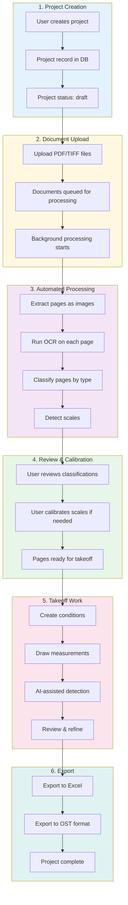
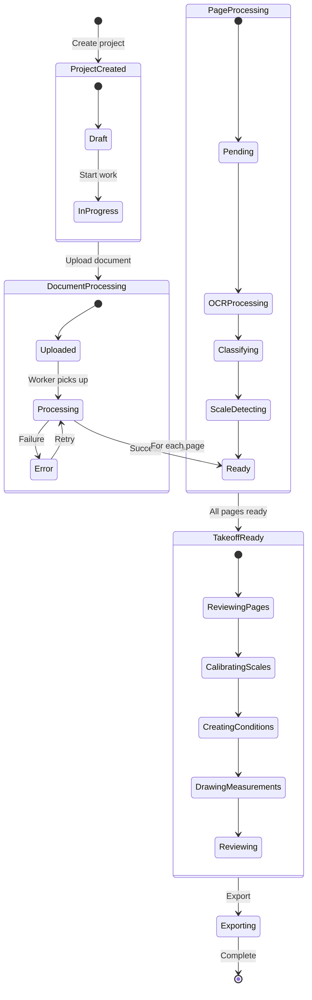
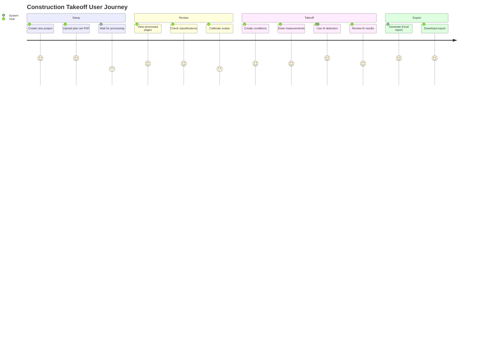
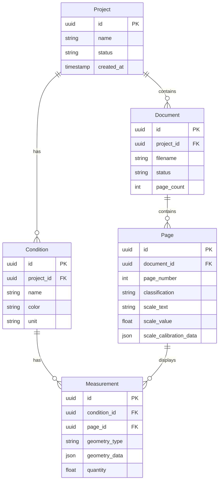

# Project Lifecycle

Complete workflow from project creation to takeoff completion.

## High-Level Overview

## Detailed State Machine

## API Endpoints by Phase

```mermaid
flowchart LR
    subgraph Project["Project APIs"]
        P1[POST /projects]
        P2[GET /projects/:id]
        P3[PUT /projects/:id]
    end

    subgraph Document["Document APIs"]
        D1[POST /projects/:id/documents]
        D2[GET /documents/:id]
        D3[GET /documents/:id/status]
    end

    subgraph Page["Page APIs"]
        PG1[GET /documents/:id/pages]
        PG2[GET /pages/:id]
        PG3[GET /pages/:id/image]
        PG4[POST /pages/:id/detect-scale]
        PG5[PUT /pages/:id/scale]
    end

    subgraph Condition["Condition APIs"]
        C1[POST /projects/:id/conditions]
        C2[GET /conditions/:id]
        C3[PUT /conditions/:id]
    end

    subgraph Measurement["Measurement APIs"]
        M1[POST /conditions/:id/measurements]
        M2[GET /measurements/:id]
        M3[PUT /measurements/:id]
    end

    subgraph Export["Export APIs"]
        E1[POST /projects/:id/export]
        E2[GET /exports/:id]
    end

    Project --> Document --> Page --> Condition --> Measurement --> Export
```

## User Journey

## Data Model Relationships

## Processing Timeline

```mermaid
gantt
    title Document Processing Timeline
    dateFormat  ss
    axisFormat %S

    section Upload
    File upload           :a1, 00, 2s
    Store original        :a2, after a1, 1s

    section Extraction
    Extract pages         :b1, after a2, 5s
    Generate thumbnails   :b2, after b1, 2s

    section OCR
    OCR processing        :c1, after b2, 10s

    section Classification
    Classify pages        :d1, after c1, 5s

    section Scale
    Detect scales         :e1, after d1, 8s

    section Ready
    Pages ready           :milestone, after e1, 0s
```

