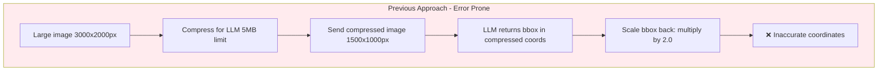
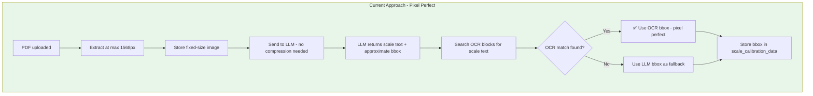
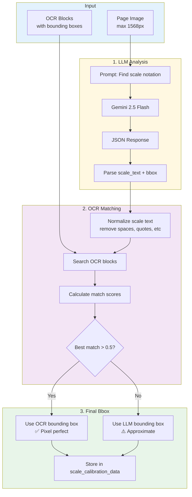
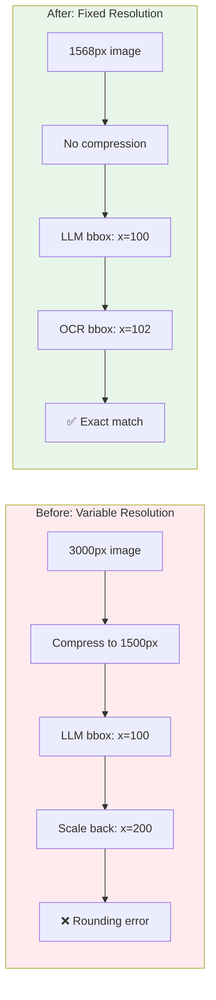

# Scale Detection Accuracy

How scale detection achieves pixel-perfect bounding box accuracy.

## The Problem (Before Fix)



**Issues:**
- Compression scale factor tracking was complex
- Reverse-scaling introduced rounding errors
- LLM bbox estimates were approximate, not pixel-perfect

## The Solution (Current)



## Detailed Scale Detection Flow



## OCR Block Matching Algorithm

```mermaid
flowchart TD
    A[LLM detected: "1/4\" = 1'-0\""] --> B[Normalize: "1410"]
    
    C[OCR Blocks] --> D[For each block]
    D --> E[Normalize block text]
    E --> F{Exact match?}
    F -->|Yes| G[Score = 1.0]
    F -->|No| H{Partial match?}
    H -->|Yes| I[Score = overlap ratio]
    H -->|No| J[Score = 0]
    
    G --> K[Track best match]
    I --> K
    J --> K
    
    K --> L{Best score > 0.5?}
    L -->|Yes| M[Return OCR bbox]
    L -->|No| N[Try combining nearby blocks]
    N --> O{Combined match?}
    O -->|Yes| P[Return combined bbox]
    O -->|No| Q[Fall back to LLM bbox]
```

## Why Fixed Resolution Matters



## Coordinate System

```
(0,0) ─────────────────────────────► X
  │
  │    ┌─────────────────────────┐
  │    │                         │
  │    │      Page Image         │
  │    │      1568 x 1045        │
  │    │                         │
  │    │   ┌──────────────┐      │
  │    │   │ Scale: 1/4"  │ ◄── bbox {x, y, width, height}
  │    │   └──────────────┘      │
  │    │                         │
  │    └─────────────────────────┘
  ▼
  Y

All coordinates are in pixels, origin top-left.
No scaling or transformation needed.
```

## Key Files

| File | Role |
|------|------|
| `backend/app/services/scale_detector.py` | Main detection logic, OCR matching |
| `backend/app/services/llm_client.py` | LLM API calls (no compression) |
| `backend/app/workers/scale_tasks.py` | Celery task orchestration |
| `frontend/src/pages/TakeoffViewer.tsx` | Renders bbox overlay on canvas |

---

## Experimental: TIFF Format for Coordinate Accuracy (January 2026)

> **Status**: Testing in progress. This section documents an experimental approach to further improve coordinate accuracy.

### Hypothesis

By storing page images as TIFF instead of PNG, we can:

1. **Eliminate format inconsistencies** - PDFs with embedded fonts, layers, and transparency are flattened to clean raster images
2. **Ensure identical input** - OCR, LLM, and frontend all see the exact same pixels
3. **Remove any potential PNG encoding variations** - TIFF with LZW is a simpler, more predictable format

### The Experimental Approach

```mermaid
flowchart TD
    subgraph Current["Current: Fixed Resolution PNG"]
        A1[PDF uploaded] --> B1[Extract at max 1568px]
        B1 --> C1[Save as PNG]
        C1 --> D1[Store in MinIO]
        D1 --> E1[Send PNG to LLM/OCR]
    end

    subgraph Experimental["Experimental: Fixed Resolution TIFF"]
        A2[PDF uploaded] --> B2[Extract at max 1568px]
        B2 --> C2[Save as TIFF with LZW]
        C2 --> D2[Store in MinIO]
        D2 --> E2[Send TIFF to LLM/OCR]
    end

    subgraph Benefit["Expected Benefit"]
        F[PDF layers/fonts/effects]
        F --> G[Flattened to clean raster]
        G --> H[Consistent coordinates across all tools]
    end

    style Current fill:#e3f2fd
    style Experimental fill:#e8f5e9
    style Benefit fill:#fff8e1
```



### Why TIFF?

| Factor | PNG | TIFF (LZW) |
|--------|-----|------------|
| Compression | Lossless | Lossless |
| PDF flattening | Yes | Yes |
| Industry standard for plans | Common | Very common |
| Multi-page support | No | Yes (native) |
| LLM compatibility | All providers | All providers |

### Changes Made

1. **`backend/app/utils/pdf_utils.py`**
   - `extract_pdf_pages_as_images()` default format: `PNG` → `TIFF`
   - `extract_tiff_pages_as_images()` default format: `PNG` → `TIFF`
   - `resize_image_for_llm()` default format: `PNG` → `TIFF`
   - Added `_save_image()` helper with LZW compression for TIFF

2. **`backend/app/services/document_processor.py`**
   - Storage key: `image.png` → `image.tiff`
   - Content type: `image/png` → `image/tiff`
   - Thumbnails remain PNG (web-friendly)

3. **`backend/app/services/llm_client.py`**
   - No changes needed - `_detect_media_type()` already handles TIFF magic bytes

### Coordinate System (Unchanged)

```
(0,0) ─────────────────────────────► X
  │
  │    ┌─────────────────────────┐
  │    │                         │
  │    │   Page Image (TIFF)     │
  │    │      1568 x 1045        │
  │    │                         │
  │    │   ┌──────────────┐      │
  │    │   │ Scale: 1/4"  │ ◄── bbox {x, y, width, height}
  │    │   └──────────────┘      │
  │    │                         │
  │    └─────────────────────────┘
  ▼
  Y

All coordinates remain in pixels, origin top-left.
The only change is the underlying image format.
```

### Testing Metrics

To validate this approach, compare:

| Metric | Before (PNG) | After (TIFF) |
|--------|--------------|--------------|
| OCR bbox accuracy | Baseline | TBD |
| LLM scale detection | Baseline | TBD |
| Scale highlight alignment | Baseline | TBD |
| File size | Baseline | TBD |

### Rollback Plan

If TIFF doesn't improve accuracy or causes issues:

1. Revert `fmt` defaults back to `"PNG"` in `pdf_utils.py`
2. Revert storage key to `image.png` in `document_processor.py`
3. Revert content type to `image/png`

No database schema changes are required - only storage keys in existing records would reference `.png` vs `.tiff`.
